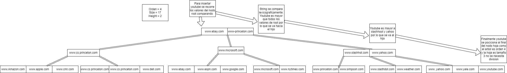

<div align="center">
<table>
    <theader>
        <tr>
            <td></td>
            <th>
                <span style="font-weight:bold;">UNIVERSIDAD NACIONAL DE SAN AGUSTIN</span><br />
                <span style="font-weight:bold;">FACULTAD DE INGENIERÍA DE PRODUCCIÓN Y SERVICIOS</span><br />
                <span style="font-weight:bold;">DEPARTAMENTO ACADÉMICO DE INGENIERÍA DE SISTEMAS E INFORMÁTICA</span><br />
                <span style="font-weight:bold;">ESCUELA PROFESIONAL DE INGENIERÍA DE SISTEMAS</span>
            </th>
            <td></td>
        </tr>
    </theader>
    <tbody>
        <tr><td colspan="3"><span style="font-weight:bold;">Formato</span>: Guia de Practica de Laboratorio/Talleres/Centros de Simulación</td></tr>
        <tr><td><span style="font-weight:bold;">Aprobación</span>:  2022/03/01</td><td><span style="font-weight:bold;">Código</span>: GUIA-PRLE-001</td><td><span style="font-weight:bold;">Página</span>: 1</td></tr>
    </tbody>
</table>
</div>

<div align="center">
<span style="font-weight:bold;">INFORME DE LABORATORIO</span><br />
</div>


<table>
<theader>
<tr><th colspan="6">INFORMACIÓN BÁSICA</th></tr>
</theader>
<tbody>
<tr><td>ASIGNATURA:</td><td colspan="5">Estructura de Datos y Algoritmos</td></tr>
<tr><td>TÍTULO DEL LABORATORIO:</td><td colspan="5">ARBOL B</td></tr>
<tr>
<td>NÚMERO DE LABORATORIO:</td><td>06</td><td>AÑO LECTIVO:</td><td>2022 A</td><td>NRO. SEMESTRE:</td><td>III</td>
</tr>
<tr>
<td>FECHA INICIO::</td><td>03-Agosto-2022</td><td>FECHA FIN:</td><td>07-Agosto-2022</td><td>DURACIÓN:</td><td>02 horas</td>
</tr>
<tr><td colspan="6">RECURSOS:
    <ul>
        <li>https://www.w3schools.com/java/</li>
        <li>https://www.eclipse.org/downloads/packages/release/2022-03/r/eclipse-ide-enterprise-java-and-web-developers</li>
        <li>https://www.cs.usfca.edu/~galles/visualization/BTree.htmlhttps://docs.oracle.com/javase/8/docs/api/java/util/Stack.html</li>
    </ul>
</td>
</<tr>
<tr><td colspan="6">INTEGRANTES:
<ul>
<li>RVladimir Arturo Sulla Quispe - vsullaq@unsa.edu.pe</li>
</ul>
</td>
</<tr>
<tr><td colspan="6">DOCENTES:
<ul>
<li>Richart Smith Escobedo Quispe - rescobedoq@unsa.edu.pe</li>
</ul>
</td>
</<tr>
</tdbody>
</table>

# SOLUCION Y RESULTADOS
## SOLUCION DE EJERICICOS/PROBLEMAS

### Ejercicio 1

Modificar el método de obtención de valor dado una clave (5 puntos)
En el código, para la clave www.simpsons.com, invocado de la siguiente manera:
```java
System.out.println("simpsons.com: " + st.get("www.simpsons.com"));
```
Retorna:

```
simpsons.com: 209.052.165.60
```

Para la clave "www.cs.princeton.edu", retorna:
``` 
cs.princeton.edu: 128.112.136.12
``` 
Se puede observar que se está obteniendo el valor de la primera clave encontrada.
Dado que al árbol se le ingresan dos valores:

``` 
st.put("www.cs.princeton.edu", "128.112.136.12");
st.put("www.cs.princeton.edu", "128.112.136.11");
``` 

Se requiere: Modificar el código para que también pueda mostrarse todos los
valores asociados a la clave.

El codigo original mostrado en el ejercicio es: 
```java
    public Value get(Key key) {
        if (key == null) throw new IllegalArgumentException("argument to get() is null");
        return search(root, key, height);
    }

    private Value search(Node x, Key key, int ht) {
        Entry[] children = x.children;
        // Busqueda en las hojas del arbol
        if (ht == 0) {
            for (int j = 0; j < x.m; j++) {
                if (eq(key, children[j].key)) 
                	return (Value)children[j].val;
            }
        }

        else {
            for (int j = 0; j < x.m; j++) {
                if (j+1 == x.m || less(key, children[j+1].key))
                    return search(children[j].next, key, ht-1);
            }
        }
        return null;
    }

```
El problema con el codigo es que al encontrar el valor de la llave retorna inmediatamente sin evaluar
los demas valores para ello se cambia el tipo de retorno "Value" por un "ArrayList". 

```java
    public ArrayList<Value> get(Key key) {
        if (key == null) throw new IllegalArgumentException("argument to get() is null");
        return search(root, key, height);
    }

    private ArrayList<Value> search(Node x, Key key, int ht) {
        Entry[] children = x.children;

        if (ht == 0) {
            for (int j = 0; j < x.m; j++) {
                
                if (eq(key, children[j].key)){
                    //Aqui se cambia el return de un su valor por un arraylist de valores
                    ArrayList<Value> values = new ArrayList<Value>();  
                    while(eq(key, children[j].key)){
                        values.add((Value)children[j].val);
                        j++;
                    }
                    return values;
                }
            }
        }

        else {
            for (int j = 0; j < x.m; j++) {
                if (j+1 == x.m || less(key, children[j+1].key))
                    return search(children[j].next, key, ht-1);
            }
        }
        return null;
    }
```

### Ejercicio 2
Mostrar en un diagrama de árbol gráficamente la estructura final para los datos
ingresados.

El diagrama final del arbol es :


### Ejercicio 3

El método toString() del árbol, retorna lo siguiente. ¿Por qué están entre paréntesis
ciertas claves?
```
    www.amazon.com 207.171.182.16
    www.apple.com 17.112.152.32
    www.cnn.com 64.236.16.20
(www.cs.princeton.edu)
    www.cs.princeton.edu 128.112.136.12
    www.cs.princeton.edu 128.112.136.11
    www.dell.com 143.166.224.230
(www.ebay.com)
    www.ebay.com 66.135.192.87
    www.espn.com 199.181.135.201
    www.google.com 216.239.41.99
(www.microsoft.com)
    www.microsoft.com 207.126.99.140
    www.nytimes.com 199.239.136.200
(www.princeton.edu)
    www.princeton.edu 128.112.128.15
    www.simpsons.com 209.052.165.60
(www.slashdot.org)
    www.slashdot.org 66.35.250.151
    www.weather.com 63.111.66.11
(www.yahoo.com)
    www.yahoo.com 216.109.118.65
    www.yale.edu 130.132.143.21
```
Los datos entre parentesis corresponden a los nodos que no son hojas, Esto se obtiene si es que se imprime la altura de cada nodo:

```java
    public String toString() {
        return toString(root, height, "") + "\n";
    }

    private String toString(Node h, int ht, String indent) {
        StringBuilder s = new StringBuilder();
        Entry[] children = h.children;

        if (ht == 0) {
            for (int j = 0; j < h.m; j++) {
                //Añadido ht(altura del nodo)
                s.append(indent + children[j].key + " " + children[j].val +  ht + "\n");
            }
        }
        else {
            for (int j = 0; j < h.m; j++) {
                if (j > 0){
                    //Añadido altura del nodo(ht)    
                    s.append(indent + "(" + children[j].key + ")" + ht + "\n");
                }
                s.append(toString(children[j].next, ht-1, indent + "     "));
            }
        }
        return s.toString();
    }

```
Los resultados son

```
    www.amazon.com 207.171.182.16 0
    www.apple.com 17.112.152.32 0
    www.cnn.com 64.236.16.20 0
(www.cs.princeton.edu)1
    www.cs.princeton.edu 128.112.136.12 0
    www.cs.princeton.edu 128.112.136.11 0
    www.dell.com 143.166.224.230 0
(www.ebay.com)2
    www.ebay.com 66.135.192.87 0
    www.espn.com 199.181.135.201 0
    www.google.com 216.239.41.99 0
(www.microsoft.com)1
    www.microsoft.com 207.126.99.140 0
    www.nytimes.com 199.239.136.200 0
(www.princeton.edu)2
    www.princeton.edu 128.112.128.15 0
    www.simpsons.com 209.052.165.60 0
(www.slashdot.org)1
    www.slashdot.org 66.35.250.151 0
    www.weather.com 63.111.66.11 0
(www.yahoo.com)1
    www.yahoo.com 216.109.118.65 0
    www.yale.edu 130.132.143.21 0
```

### Ejercicio 4

Agregar un nodo adicional (www.youtube.com, 134.24.13.78) y mostrarlo paso a
paso.



## CONCLUSIONES
 
# RETROALIMENTACION GENERAL

# REFERENCIAS Y BIBLIOGRAFIA
Weiss M., Data Structures & Algorithm Analysis Using Java, 2010, Addison-Wesley.
Capítulo 4. Representación de conjuntos mediante arboles, Departamento de Informática y Sistemas Área de Lenguajes y Sistemas, Universidad de Murcia, pag.168
https://www.cs.usfca.edu/~galles/visualization/BTree.html
https://ccia.ugr.es/~jfv/ed1/tedi/cdrom/docs/arb_B.htm